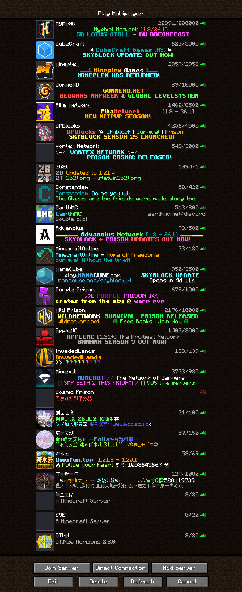

# mcping-api

Minecraft 服务器 ping + 原版风格出图的独立 HTTP API。核心是从 abot 抽出的自包含 `minecraft`
集成(SLP / RakNet ping + MOTD / 1.16.5「Play Multiplayer」选服界面 / 数据卡渲染),这里只加一层薄
HTTP 壳。无数据库、无外部服务,单二进制 + 内嵌字体/贴图。

crate 形态为 lib + bin:`src/lib.rs` 暴露 `pub mod minecraft`(可作库复用),`src/main.rs` 是 API 二进制。

<p align="center"></p>
<p align="center"><sub><code>GET /list</code> 批量并行 ping 26 台服务器出的原版列表长图(连不上的也进图)。</sub></p>

## 运行

```sh
cargo run --release                        # 默认监听 0.0.0.0:8686
BIND=127.0.0.1:9000 ./target/release/mcping-api   # 自定义监听地址
```

`edition` 默认 `auto`:先按 Java(SLP/TCP)查,连不上再换基岩(RakNet/UDP);也可 `je` / `be` 锁定。

## 端点

### `GET /ping?host=<地址>[&edition=auto|je|be]` → JSON

```sh
curl 'http://127.0.0.1:8686/ping?host=mc.hypixel.net'
```
返回 `{ host, port, via_srv, edition, online, max, version, protocol, latency_ms, motd, favicon, players }`。

### `GET /image?host=<地址>[&style=screen|card][&edition=…][&name=…]` → PNG

- `style=screen`(默认):原版 1.16.5「Play Multiplayer」整屏复刻(单台,选中条目 + 页脚按钮)。
- `style=card`:完整数据卡(图标 + 5 行含延迟/版本/模组/Via + 玩家 sample)。
- `name`:覆盖条目展示名(默认用地址)。

```sh
curl 'http://127.0.0.1:8686/image?host=mc.hypixel.net&name=Hypixel' -o hypixel.png
```

### `GET /list?hosts=a,b,c[&names=A,B,C][&style=screen|card][&edition=…]` → PNG(长图)

并行 ping 多台,出一张长图(条目多就拉高):
- `style=screen`(默认)——原版 1.16.5 列表样式;连不上的也进图(红 ✗ + 「无法连接」)。
- `style=card`——每台一张完整数据卡竖排;连不上的出不了卡,跳过并经响应头 `X-Unreachable-Count` 告知数量。

```sh
curl 'http://127.0.0.1:8686/list?hosts=mc.hypixel.net,2b2t.org&names=Hypixel,2b2t' -o list.png
curl 'http://127.0.0.1:8686/list?hosts=mc.hypixel.net,2b2t.org&style=card' -o cards.png
```

## 来源

`src/minecraft/` 整体抽自 abot 的 `src/integrations/minecraft/`(纯 Rust、自包含),`assets/minecraft/`
为内嵌的原版字体(`mcfont.bin` / `unifont_bmp.bin`)与 GUI 贴图(取自 1.16.5 客户端 jar)。

## 许可

代码以 **AGPL-3.0-or-later** 授权(见 [`LICENSE`](LICENSE))。作为网络服务部署时,AGPL 要求向使用者提供
对应源码。

内嵌的 `assets/minecraft/` 美术资源不在本项目的 AGPL 范围内,各依其原始许可:`unifont_bmp.bin` 为
GNU Unifont(SIL OFL 1.1 / GPLv2+ font exception);`mcfont.bin` 与 GUI 贴图(`gui/`、`sprites/`)
为 Mojang 美术资源,版权归 Mojang,本仓仅作渲染复刻用途内嵌,详见 [`assets/minecraft/SOURCE.md`](assets/minecraft/SOURCE.md)。
